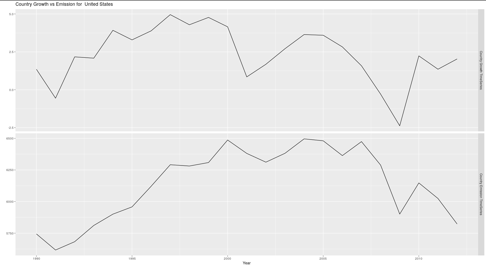
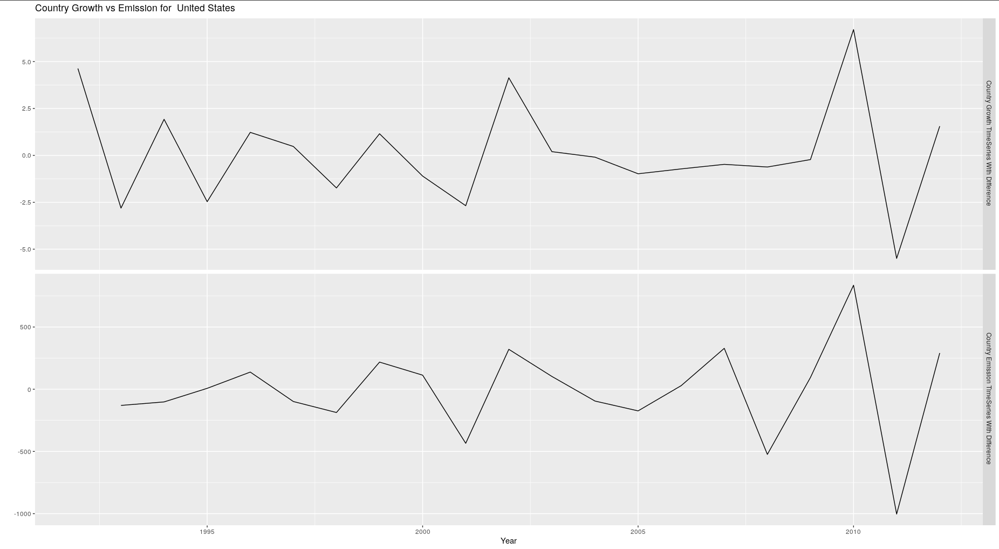
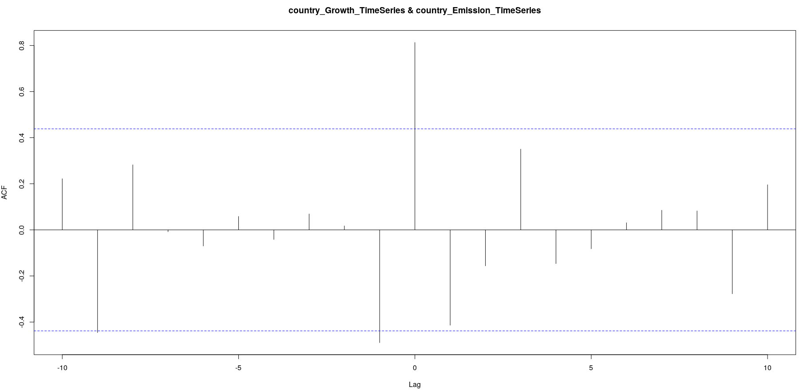
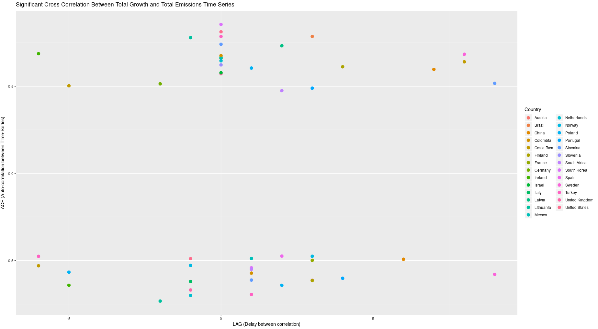
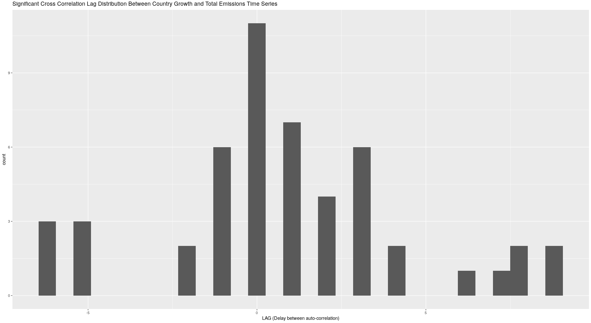
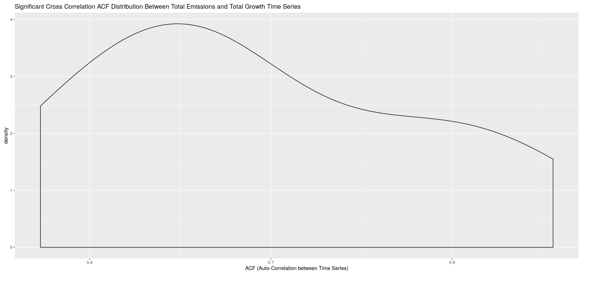

```{r setup, include=FALSE, warning=FALSE, message=FALSE}

# Set some options
knitr::opts_chunk$set(echo = FALSE, fig.height = 8, fig.width = 17)
skimr::skim_with(numeric = list(hist = NULL))

# Source Script File 
source('EmissionEDA.R')

# load libraries
library(countrycode)
library(ggrepel)
library(fable)
library(feasts)
library(forecast)
library(ggthemes)
library(janitor)
library(lmtest)
library(lubridate)
library(plotly)
library(plyr)
library(skimr)
library(tidyverse)
library(tsibble)
library(viridis)
library(maps)
library(purrr)
```

# Introduction and Objectives

The event of climate change has been a frequently discussed topic especially as of late. Although a considerable amount of people deny the magnitude of the event, there is an increased fear of the general repercussions of global warming. This fear has lead to a significant public pressure being applied to governments around the world demanding increased regulations in order to help prevent climate change. This has been especially the case in late 2019 where protesters in increasing numbers demonstrated to spread awareness as well as encourage a greater response from legislators. In addition, the protesters also criticize the adherence to international protocols, thereby questioning the effect of global treaties on government greenhouse gas(GHG) emission legislation.   

There are several possible reasons explaining the government reluctance. It may be the case that there is a negative economic impact in the imposing of strict emission regulation as emission could be related to economy growth. It could also be the case that governments have been imposing regulations as a result of international accords. In addition, it is possible that regulations are simply not effective enough to invoke a reduction in emissions.  

In this report, we will attempt to gain insight on the reasons causing government reluctance as well as the global effect of protocol. This involves the following objectives :

* Identify relationship between total GHG emissions and total economic growth 
<!-- * Identify relationship between environmental tax revenue and total GHG emissions -->
* Analyze the effect of international protocols on government emission legislation 
* Identify relationship of total emission and particulate damage


# Emission Relationships

Part of the objectives involve identifying and potentially quantifying a relationship between the total greenhouse gas emissions and different variables. These variables include the environmental tax revenue as well as the total economic growth. It is important to note that the goal is not to identify a cause or effect but rather discover a common relationship between the variables for a number of countries. 

## Definition of Variables

### Total Growth

The total growth of an economy was measured by its annual growth rate. Moreover, the annual growth rate represents the percentage change in total growth of the country's GDP. In this context, "total" refers to the sum among all sectors. The data set used for this was sourced from the Organisation for Economic Co-operation and Development(OECD) which provided the total growth per sub-sector(activity) for a given country per year.[1]


### Total Emissions

The total emissions for a given country was measured by the sum of all of its greenhouse gas emissions for a given year. This includes the sum of the emissions of six gases classified as greenhouse gases. [2] The emission data was compiled over the course of over 20 years depending on the country.

### Environmental Tax Revenue

The environmental tax revenue is expressed as the percentage of the given country's GDP. These tax revenues are generated from a variety of environmental domains. These domains include energy products, vehicle fuels, motor vehicles and transport services as well as other various other industries that are subject to an environmental tax. [3]

## Methodology
 
In order to gain insight on the relationship, a time series analysis is especially relevant. For each country, a separate time series for each of the respective variables was to be constructed. In every individual case, we wish to gain insight on whether one series' changes is related to the other. We then evaluate the cross-correlations of the two time series using a cross correlation test with 95% confidence bounds. 

To conduct a cross-correlation test, time series must be stationarized meaning that the mean and variance of the time series remains constant over time. To stationarized a given time series, differencing is necessary in which the change in value from one point is computed with a subsequent point in the time series. The stationarity of the time series is then confirmed by a ADF test as well as a KPSS test to test for trend-stationarity. 


```{r, warning=FALSE, fig.cap="\\label{fig:figs}Raw Time Series"}
plot_ts(em_tot_growth_merged_df, "United States", diff=FALSE)
```
<!--  -->

```{r, warning=FALSE, fig.cap="\\label{fig:figs}Differenced Time Series"}
plot_ts(em_tot_growth_merged_df, "United States", diff=TRUE)
```
<!--  -->


This was accomplished by an automated procedure that would both stationarize ad hoc and compute the cross-correlations for two given-time series.

<!--  -->

```{r, message=FALSE, warning=FALSE, echo=FALSE}
plot_ccf(em_tot_growth_merged_df, "United States")
```

This process was to be completed for each country in data set that had sufficient year entries in order to construct the time series. In this case the cutoff was seven years as this would allow us to test for a reasonable amount of countries due to data set limitations. The statistically significant(\alpha = 0.05) country cross-correlations are then plotted together onto an amalgamated ACF plot that can then be analyzed.

## GHG Emissions and Economic Growth

### Hypothesis
It was hypothesized that there would be a positive relationship between emissions and total economy growth. In other words, a rise in green-house gas emissions would be correlated with a rise in economic growth. This is mainly because it is believed that emissions are generally associated with an increased industrial output and thus, intuitively, a rise in emissions would be followed by an increase in economic growth.

This would ideally be demonstrated by the emission time series serving as a positive lagging indicator for the economic growth time series. This is where the effect of increase in the emission time series transfers to the economic growth time series several periods(years) later. 

### Results

The results were quite inconclusive but they did provide valuable insight. The resulting plot of cross-correlation was quite scattered with significant cross-correlations spread sparsely across the LAG axis. This can be observed in the plot below which represents the significant cross-correlations between economic growth and total emissions. This thus refuted our hypothesis as we expected cross-correlations to clearly tend to a negative lag with a positive cross-correlation. 

```{r, message=FALSE, warning=FALSE, echo=FALSE}
countries_gr_em_ccf_res %>%
  ggplot(
    aes(
      x = (LAG),
      y = (ACF),
      color = country
    )
  ) +
  geom_point(size = 3) +
  labs(
    x = "LAG (Delay between correlation)",
    y = "ACF (Auto-correlation between Time-Series)",
    colour = 'Country',
    title = "Significant Cross Correlation Between Total Emissions and Total Growth Time Series"
  )
```
<!--  -->

Interestingly, there appeared to be clusters in the 0, -1 and 1 lags. Notably, the largest cluster was located at the 0 lag and had a strongly positive auto-correlation. This would indicate that a rise in emissions is directly auto-correlated with an increase in economic growth in the same year. However, this cluster size is not significant enough to draw that conclusion.

```{r, message=FALSE, warning=FALSE, echo=FALSE}
countries_gr_em_ccf_res %>% 
  ggplot(
    aes(
      x = (LAG)
    )
  ) +
  geom_histogram() +
  labs(
    x = "LAG (Delay between auto-correlation)",
    colour = 'Country',
    title = "Significant Cross Correlation Lag Distribution Between Total Emissions and Total Growth Time Series"
  )
```
<!--  -->

```{r, message=FALSE, warning=FALSE, echo=FALSE}
countries_lagz <- countries_gr_em_ccf_res %>% filter(LAG == 0) %>% select("country")
countries_gr_em_ccf_res %>% filter(LAG == 0) %>% 
  ggplot(
    aes(
      x = (ACF)
    )
  ) +
  geom_density() +
  labs(
    x = "ACF (Auto-Correlation between Time Series)",
    colour = 'Country',
    title = "Significant Cross Correlation ACF Distribution Between Total Emissions and Total Growth Time Series "
  )
```
<!--  -->

It was also difficult to draw a conclusion from the group of countries that were presented in this cluster. These countries included South Korea, Mexico, Netherlands, Slovakia, Turkey, United Kingdom, Slovenia, and the	United States. It is possible that there is a shared economic attribute between these countries but it is not obvious. 

Thus, the insight gained is that there is no evident cross-correlation between the total emission and economic growth for *all* countries. It could be the case that a significant cross correlation exists for countries with a specific economic attribute. 

### Flaws and Further Exploration

A major flaw in our methodology is that the significance level was not adjusted for the number of tests being done for each individual country. This is especially the case for evaluating the significance of the cross-correlations. This may have perhaps lead to more conclusive results.

A further analysis could have been to classify countries by development level and then evaluate their respective emission/growth cross-correlations. This could have added more insight in terms of meaning of the different cross-correlation clusters at different lags.

## Environmental Tax Revenue and GHG Emissions

### Hypothesis

For the purpose of our analysis, it is inferred that the an increase in environmental tax revenue can indicate either an increased violation of emission regulations by industries or stringent regulations that are difficult to observe. This is a reasonable assumption as the environmental tax revenue represents the government revenue generated from environmentally related taxes. 

This leads us to believe that the environmental tax revenue will serve as a lagging indicator with the emission time series. In other words, total emissions will react to the change of environmental tax will transfer to the total emissions years later. It also believed that this relationship will be negatively cross-correlated meaning that an increase in environmental tax revenue will lead to decreased total emissions. This is ultimately evaluating the effectiveness of regulations in the reduction of emissions.

### Results

The results provided valuable insight in determining the lagging relationship between the environmental tax revenue and the total emissions. However, the results were inconclusive in evaluating whether the relationship was positive or negative. The cross-correlation plot demonstrates all the significant cross-correlations between environmental tax revenue and emissions for 79 countries of various types of economies.  

```{r, message=FALSE, warning=FALSE, echo=FALSE}
# notice how points tend to be left of 0 indicating that 
# movement in total env tax revenue in time t-x has an effect on emission in time t
countries_em_tax_ccf_res %>%
  ggplot(
    aes(
      x = (LAG),
      y = (ACF),
      color = country
    )
  ) +
  geom_point(size = 3) +
  labs(
    x = "LAG (Delay between correlation)",
    y = "ACF (Auto-correlation between Time-Series)",
    colour = 'Country',
    title = "Significant Cross Correlation Between Environmental Tax Revenue and Total Emissions Time Series"
  )
```

Upon inspection of the plot, the nature of the relationship is not easily determined as the cross-correlations do not have a clear positive or negative tendency. However, it can be inferred that the cross-correlations tend to have a negative lag as demonstrated by the lag density plot. Thus, it can be deduced that the environmental-tax revenue can serve as a lagging indicator for the total emissions of a given country. This can potentially indicate that emissions react to a change in environmental taxes. 


```{r, message=FALSE, warning=FALSE, echo=FALSE}
# notice how points tend to be left of 0 indicating that 
# movement in total env tax revenue in time t-x has an effect on emission in time t
countries_em_tax_ccf_res %>% 
  ggplot(
    aes(
      x = (LAG)
    )
  ) +
  geom_density() +
  labs(
    x = "LAG (Delay between correlation)",
    colour = 'Country',
    title = "Significant Cross Correlation ACF Distribution Between Total Emissions and Total Growth Time Series "
  )
```

### Flaws and Further Exploration

Again, major flaw in our methodology is that the significance level was not adjusted for the number of tests being done for each individual country. Another potential flaw is that multiple variables affecting the environmental tax revenue were not considered. For instance, it could be the case that the environmental tax revenue was under reported in developing countries as there is likely to be bribes in place in exchange for tax breaks. 

To remedy this potential inaccuracy, it would have been better to classify countries based on a corruption index to then analyse the emission reaction to environmental tax revenues. 

Also, a further analysis could have been to classify countries by economy type as this can heavily affect the environmental tax revenues as well as the emissions. For instance, an heavily industrial economy will have different emission reactions as a relatively green economy since it may be more difficult to adjust emission levels since the emission are integral to the country's output.


# References

1. **Total Growth Per Country:** https://data.oecd.org/natincome/value-added-by-activity.htm#indicator-chart

2. **Total Emission Per Country:** https://www.wri.org/resources/data-sets/cait-country-greenhouse-gas-emissions-data

3. **Environmental Tax Revenue:** https://data.oecd.org/envpolicy/environmental-tax.htm


