```{r setup, include=FALSE, warning=FALSE, message=FALSE}

# Set some options
knitr::opts_chunk$set(echo = FALSE, fig.height = 8, fig.width = 17)
skimr::skim_with(numeric = list(hist = NULL))

# load libraries
library(countrycode)
library(ggrepel)
library(fable)
library(feasts)
library(forecast)
library(ggthemes)
library(janitor)
library(lmtest)
library(lubridate)
library(plotly)
library(plyr)
library(skimr)
library(tidyverse)
library(tsibble)
library(viridis)
```

# Objectives 

- Identify a relationship between emissions and economy growth.

- Identify a relationship between emission and environement damages

- Identify protocol installment effect on government regulation activity

- Identify relationship between environmental tax revenue and emission

# Global Activity Growth Overview 

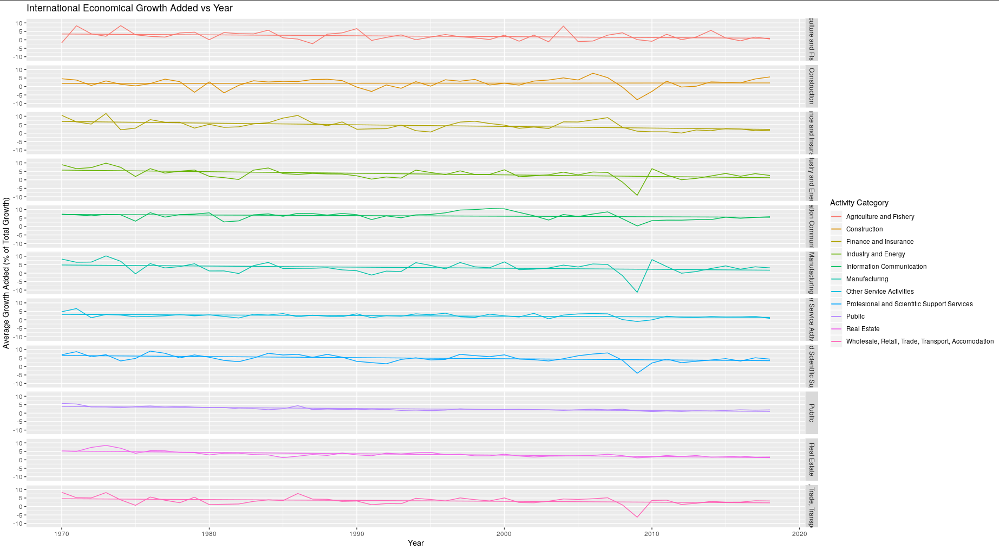


# Identifying Relationship between Emissions and Growth

- Time Series

- Stationarizing 

- Cross Correlation between Time Series

# Stationarizing 

- Statistical Properties constant over time
  - Mean
  - Variance 
  - Autocorrelation, etc. 
  
# Raw Time Series

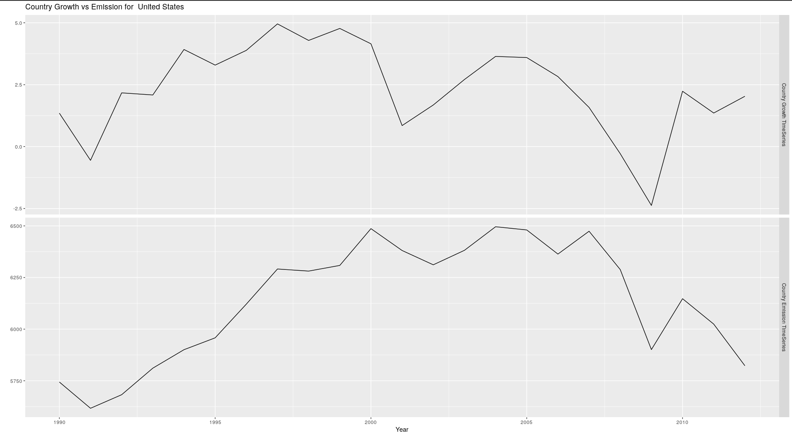

# Stationarized

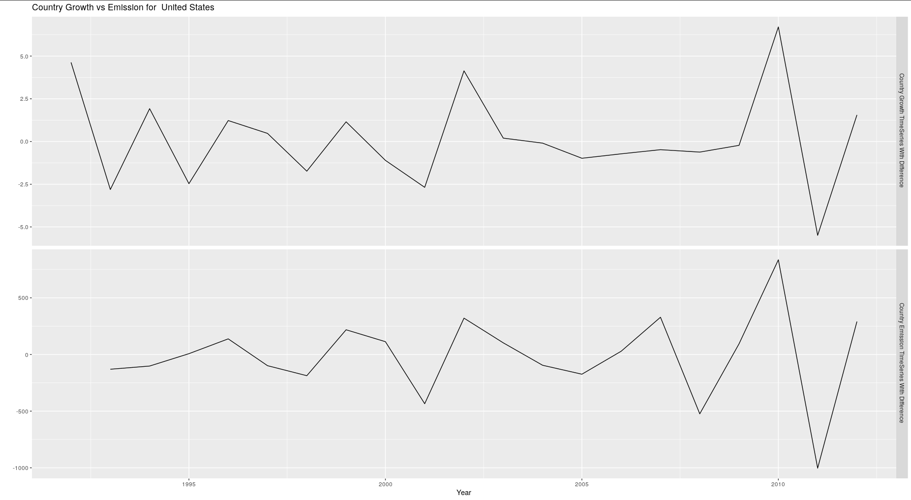

# Cross Correlation Tests

- Stationarize TimeSeries by differencing

- Test Stationarity using ADF and KPSS Test

- CCF test

# Cross Correlation

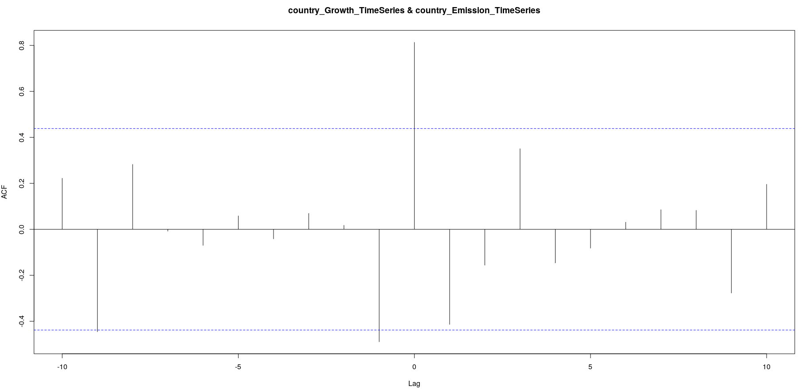

# Cross Correlation between Emission and Total Growth

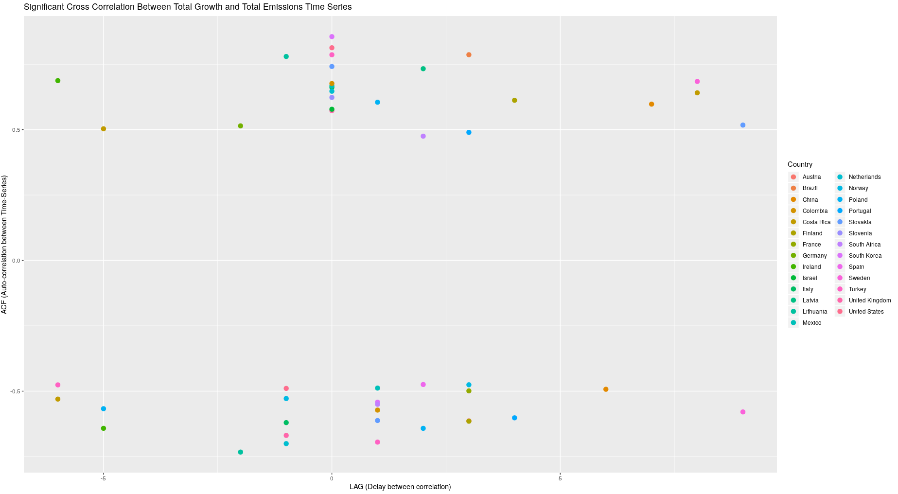

# LAG Histogram of XCorr Plot


# Auto-Correlation Density at LAG 0

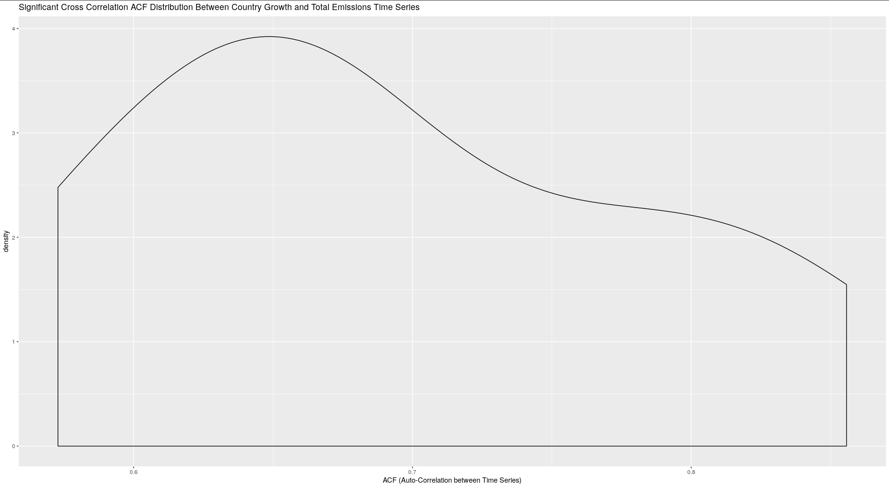

# Identifying Relationship between Emmisions and Total Environmental Tax


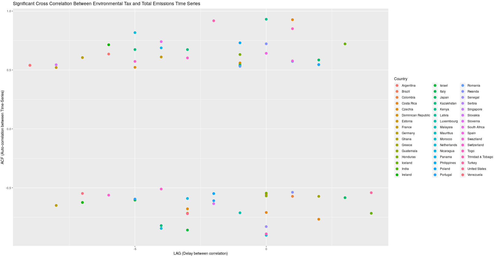


# Insights Gained

- Total Emissions at lag zero tend to have a positive effect on Economy Growth 

- Non detemined relationship at non zero lags  

- Movement in total env tax revenue in time t-x has an effect on emission in time t

- Potentially indicating an emission reaction for increased environmental taxes


# Shaafici Section

# An investigation into the relationship between particulate damage and emissions

# Definition

Long Definition Particulate emissions damage is the damage due to exposure of a country’s population to ambient concentrations of particulates measuring less than 2.5 microns in diameter (PM2.5), ambient ozone pollution, and indoor concentrations of PM2.5 in households cooking with solid fuels. Damages are calculated as foregone labor income due to premature death. Estimates of health impacts from the Global Burden of Disease Study 2016. Data for other years have been extrapolated from trends in mortality rates.

# Statistical concepts
 Within the national accounting framework, air pollution damages are estimated following a human capital approach. Damages from premature mortality are calculated as the present value of lost income during working age, 15-64. Premature mortality among children is valued by adjusting for years until working age and discounting more heavily into the future. Estimates are for both urban and rural areas. Exposure to household air pollution is proxied by the number of households in each country cooking with solid fuels.
 
# Why its relevant to developement

 Air pollution places a major burden on world health. In many places, including cities but also nearby rural areas, exposure to air pollution exposure is the main environmental threat to health. Long-term exposure to high levels of fine particulates in the air contributes to a range of health effects, including respiratory diseases, lung cancer, and heart disease, resulting in 3.2 million deaths annually according to the Global Burden of Disease 2010 study. Not only does exposure to air pollution affect the health of the world’s people, it also carries huge economic costs and represents a drag on development, particularly for low and middle income countries and vulnerable segments of the population such as children and the elderly.

# Limitations
Labor productivity losses, as calculated within the framework of adjusted net savings, represent only part of the economic costs of air pollution and should be interpreted as a lower-end estimate. 

# Source
# Mean Average for the world
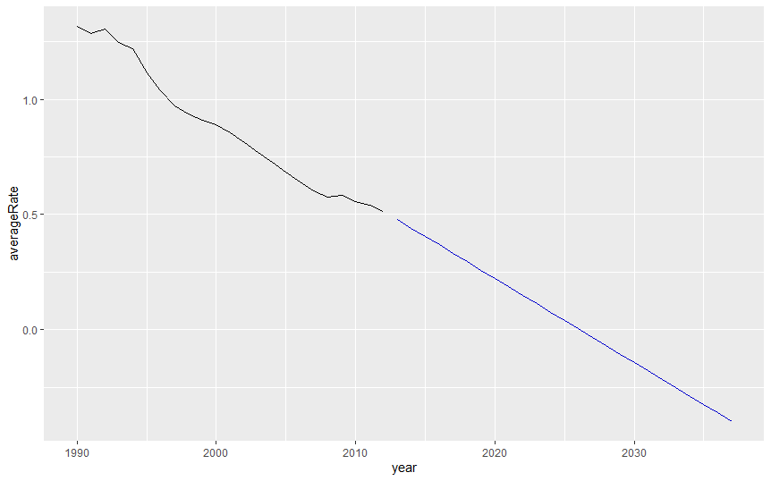

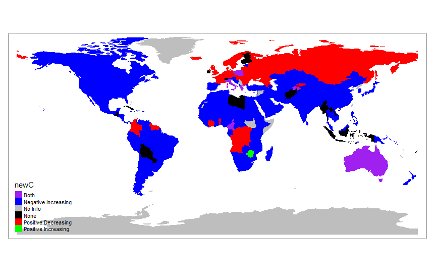
# By region
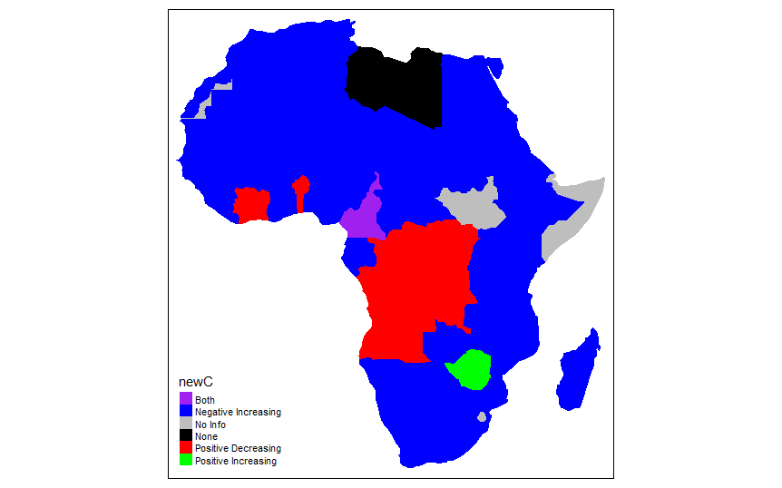

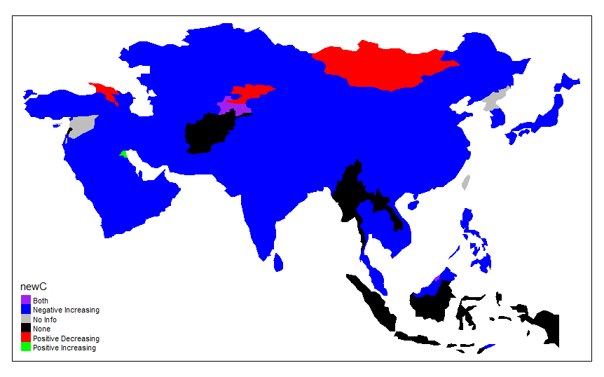

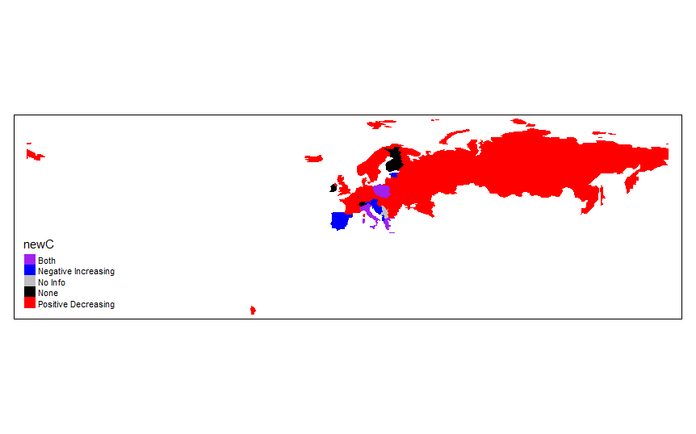
# North America
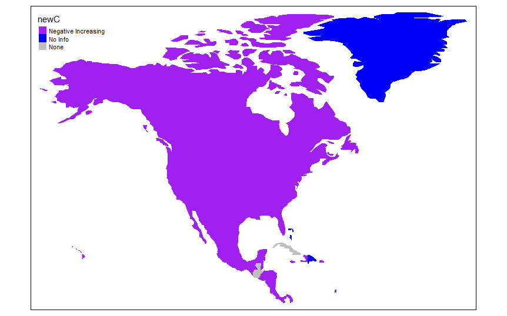
# Oceania
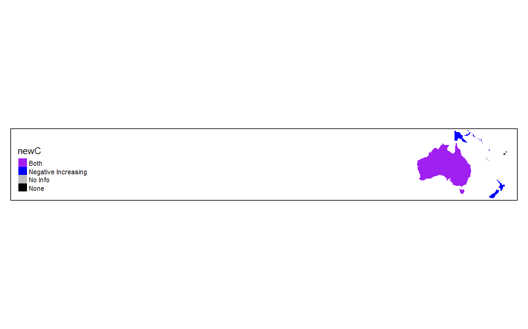

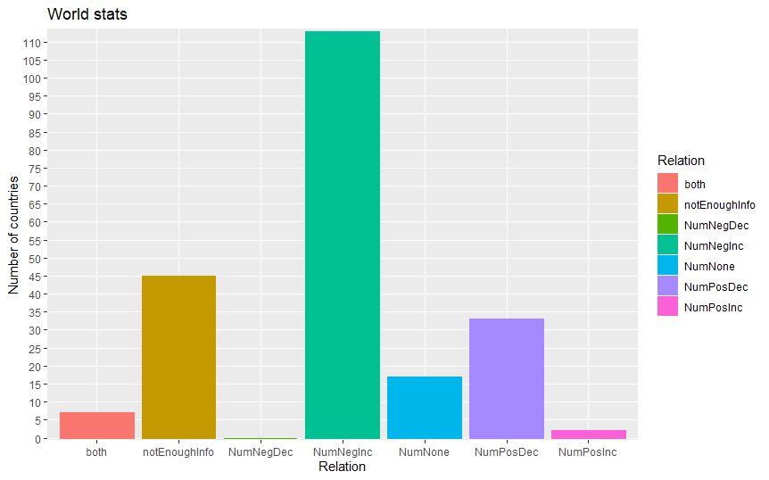
# Europe pacific

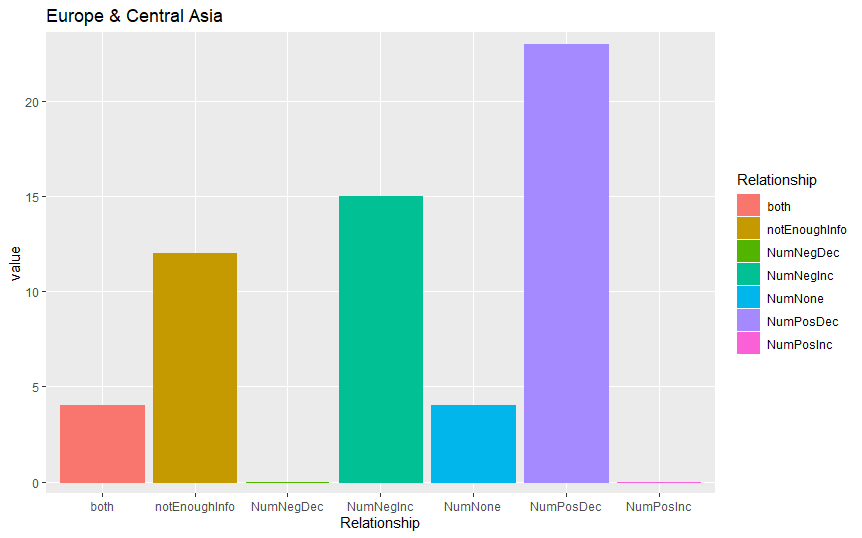


# East Asia

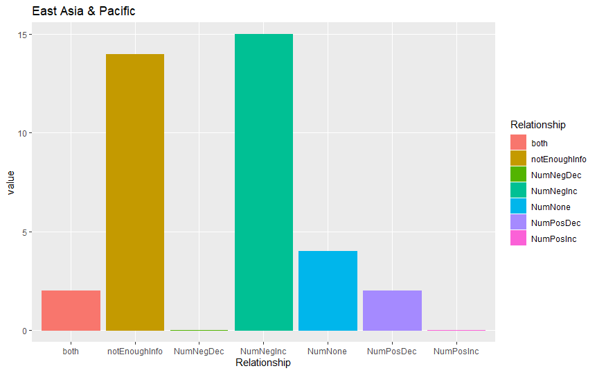


# Middle East North Africa

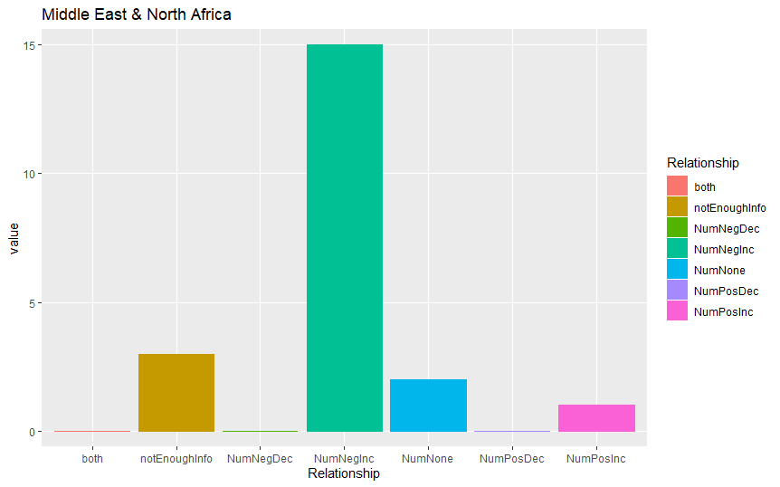

# North America

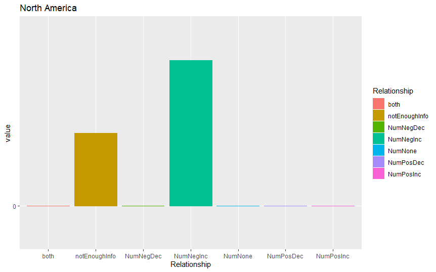

# Oceania


# Sub Saharan Africa

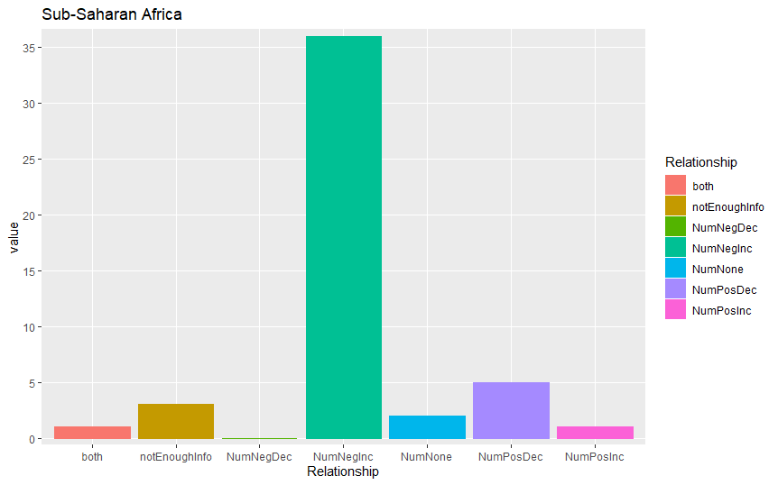

# Limitations with respect to the project

We had to make the decision to pick either APD in terms of percent of gross national income
or in total USD.Countries that are wealthier will have a higher cost then poorer countries by virtue of being larger.
Also GNI shows the relative burden to each country. But as all countries right now grow, even if the cost of particulate damage
rises it will be outgrown by the wealth of the country. 

# Conclusions made

Because of the fact that most countries ADP is going down and is negatively correlated, and the arima model shows that 
ADP will continue to decrease, The growth of each country is worth more than trying to curb the issue.


# Did the Kyoto Protocol have an effect on GHG emissions?

- International agreement to reduce greenhouse gas emissions 

- Adopted on February 16, 2005

```{r, warning=FALSE, message=FALSE}
# Load green house emissions data
country_ghg_emissions <- 
  read_csv('../data/raw/CAIT Country GHG Emissions/CAIT Country GHG Emissions.csv', skip=2) %>% 
  clean_names() %>% 
  select(country, year, total_ghg_emissions_mtco2e = total_ghg_emissions_including_land_use_change_and_forestry_mt_co_e) %>% 
  filter(country != 'World', !str_detect(country, 'European Union')) %>%  # Remove as they are not countries
  na.omit()

year_range <- country_ghg_emissions %>% 
  summarise(min_year = min(year), max_year = max(year))

# List of countries that will be omitted from analysis. They do not contain data from full year ranges 1990-2014
country_omit <- 
  country_ghg_emissions %>%
  group_by(country) %>% 
  summarise(max_year=max(year), min_year=min(year)) %>% 
  filter(max_year != year_range$max_year |
        min_year != year_range$min_year)

# Remove from df the omitted countries
country_ghg_emissions <- country_ghg_emissions %>% 
  filter(!(country %in% country_omit$country))

# Total emissions per country
country_total_ghg_emissions <- country_ghg_emissions %>% 
  group_by(country) %>% 
  summarise(total_ghg_emissions_mtco2e = sum(total_ghg_emissions_mtco2e))


world_data <- map_data('world') %>% 
  filter(region != 'Antarctica') %>% 
  mutate(region = countrycode(region, 'iso3c', 'country.name.en', nomatch=NULL))  # Replace 3 letter codes with full name

# Manually map the countries together that have different namings in both data sets
country_mappings <-
  tribble(
    ~world_data, ~country_emissions,
    'North Korea', 'Korea (North)',
    'South Korea', 'Korea (South)', 
    'Russia', 'Russian Federation',
    'UK', 'United Kingdom',
    'Ivory Coast', "Cote d'Ivoire",
    'Democratic Republic of the Congo', 'Congo, Dem. Republic',
    'Republic of Congo', 'Congo',
    'Antigua', 'Antigua & Barbuda',
    'Barbuda', 'Antigua & Barbuda',
    'Bahamas', 'Bahamas, The',
    'Bosnia and Herzegovina', 'Bosnia & Herzegovina',
    'Gambia', 'Gambia, The',
    'Trinidad', 'Trinidad & Tobago',
    'Tobago', 'Trinidad & Tobago',
    'Macedonia', 'Macedonia, FYR',
    'Saint Kitts', 'Saint Kitts & Nevis',
    'Nevis', 'Saint Kitts & Nevis',
    'Saint Vincent', 'Saint Vincent & Grenadines',
    'Grenadines', 'Saint Vincent & Grenadines',
    'Sao Tome and Principe', 'Same Tome & Principe',
    'United States', 'United States of America'
  )

world_emission_data <- world_data %>% 
  mutate(region = mapvalues(region, country_mappings$world_data, country_mappings$country_emissions)) %>% 
  inner_join(country_total_ghg_emissions, by=c('region'='country')) %>% 
  select(long, lat, group, region, total_ghg_emissions_mtco2e) %>% 
  na.omit()

# ggplot() +
#   geom_polygon(data=world_data, aes(x=long, y=lat, group=group), fill='white', colour='grey', size=0.01) +
#   coord_equal() +
#   geom_polygon(data=world_emission_data, aes(x=long, y=lat, group=group, fill=total_ghg_emissions_mtco2e)) +
#   scale_fill_viridis(name = 'Total GHG emissions (mtco2e)') +
#   labs(
#     title = 'Total GHG emissions',
#     subtitle = paste0(year_range$min_year, '-', year_range$max_year)
#   ) +
#   theme(
#     legend.position = 'bottom'
#   ) +
#   theme_map()
```


# Global effect

```{r, warning=FALSE, message=FALSE}
# As all the data is yearly we will do our analysis in terms of years
kyoto_protocol_effective_date <- c(start = ymd("2005-02-16"), end=ymd("2012-12-31"))
kyoto_start_year <- 2005

# Check worldwide effect
world_ghg_emissions_ts <- country_ghg_emissions %>% 
  group_by(year) %>% 
  summarise(total_ghg_emissions_mtco2e = sum(total_ghg_emissions_mtco2e)) %>%
  as_tsibble(index=year)

world_ghg_emissions_ts %>% 
  autoplot(total_ghg_emissions_mtco2e) +
  geom_point() +
  geom_vline(xintercept=kyoto_start_year, linetype='dashed', colour='blue') +
  geom_text(aes(x=kyoto_start_year, y=max(total_ghg_emissions_mtco2e)), label='Kyoto Protocol adopted') +
  labs(
    title = paste0('World GHG emissions'),
    subtitle = (paste0(year_range$min_year, '-', year_range$max_year)),
    x = 'Year',
    y = 'GHG emissions (mtco2e)'
  ) +
  theme_minimal()
```


# Global effect - Intervention analysis

- $y_t = \beta_0 + \beta_1 x_t + \eta_t$ where $\eta'_t = \phi_1 \eta'_{t-1} + \varepsilon_t$ [1]

```{r, message=FALSE, warning=FALSE}
# Fit regression with arima errors with intervention variable
arimaWithKyotoIntervention <- function(df_tsibble) {
  z <- df_tsibble %>% 
    transmute(z = year >= kyoto_start_year) %>% 
    pull(z) %>%
    as.numeric()
  fit <- df_tsibble %>% auto.arima(xreg=z)
  return (fit)
}

world_ghg_emissions_arima <- world_ghg_emissions_ts %>% arimaWithKyotoIntervention()

# Plot fitted values. Looks pretty good
world_ghg_emissions_arima$x %>%
  autoplot(series='Actual') +
  autolayer(world_ghg_emissions_arima$fitted, series='Fitted') +
  geom_vline(xintercept=kyoto_start_year, linetype='dashed') +
  geom_text(aes(x=kyoto_start_year, y=max(world_ghg_emissions_ts$total_ghg_emissions_mtco2e)), label='Kyoto Protocol adopted') +
  labs(
    title = 'Fitted values from ARIMA on World GHG emissions',
    subtitle = (paste0(year_range$min_year, '-', year_range$max_year)),
    x = 'Year',
    y = 'GHG emissions (mtco2e)',
    colour = 'Type'
  ) +
  theme_minimal()

# Display arima model
# summary(world_ghg_emissions_arima)
```


<!-- # Global effect - Model residuals -->

<!-- ```{r, message=FALSE, warning=FALSE} -->
<!-- world_ghg_emissions_arima %>% checkresiduals() -->
<!-- # world_ghg_emissions_arima %>% -->
<!-- #   residuals(type='innovation') %>% -->
<!-- #   as_tsibble() %>% -->
<!-- #   ggplot(aes(sample=value)) + -->
<!-- #   stat_qq() + stat_qq_line() + -->
<!-- #   ggtitle('qq-plot of the residuals') -->
<!-- ``` -->


# Global effect - Significance of post kyoto intervention

```{r, message=FALSE, warning=FALSE}
# Check p-values of coefficients
coeftest(world_ghg_emissions_arima)
```

- P-value of 0.5867 so not significant

- No difference in pre vs post Kyoto Protocol 


# Country effect

- Smaller subset of countries of interest to analyze

``` {r, message=FALSE, warning=FALSE}
# View only top n percent countries based on ghg emissions
percent_cutoff <- 0.80
country_top_total_emissions <- country_total_ghg_emissions %>% 
  arrange(total_ghg_emissions_mtco2e %>% desc()) %>%
  mutate(cum_percent_ghg = cumsum(total_ghg_emissions_mtco2e)/sum(total_ghg_emissions_mtco2e),
         percent_global_ghg_emissions = total_ghg_emissions_mtco2e / sum(total_ghg_emissions_mtco2e)) %>% 
  filter(cum_percent_ghg < percent_cutoff) %>% 
  select(-cum_percent_ghg)

# Barplot of top 80% countries avg ghg emission
country_top_total_emissions %>% 
  ggplot(aes(reorder(country, total_ghg_emissions_mtco2e), total_ghg_emissions_mtco2e)) +
  geom_bar(stat='identity') +
  geom_col(position = 'dodge') +
  geom_text(aes(label = paste0(round(percent_global_ghg_emissions*100, digits=2), '%')), hjust = -0.2, size = 3) +
  coord_flip() + 
  labs(
    title = paste0('Total GHG emissions of countries making up ', percent_cutoff*100, '% of global GHG emission'),
    subtitle = (paste0(year_range$min_year, '-', year_range$max_year)),
    x = 'Country',
    y = 'Total GHG emission (mtco2e)'
  ) +
  theme_minimal()

```


# Country effect - Emissions over time

```{r, message=FALSE, warning=FALSE}
# GHG emissions for top 80% countries over time
country_top_total_emissions_ts <-
  country_top_total_emissions %>% 
  select(country) %>% 
  inner_join(country_ghg_emissions, by='country') %>%  
  as_tsibble(key=country, index=year)

# Plot emissions time series for each country
p <- 
  country_top_total_emissions_ts %>% 
  mutate(country = fct_reorder(country, total_ghg_emissions_mtco2e, tail, n=1, .desc=TRUE)) %>% 
  autoplot(total_ghg_emissions_mtco2e) +
  geom_vline(xintercept=kyoto_start_year, linetype='dashed') +
  geom_text(aes(x=kyoto_start_year, y=max(total_ghg_emissions_mtco2e)), 
            label='Kyoto Protocol adopted', colour='black') +
  labs(
    title = paste0('Total GHG emissions of countries making up ', percent_cutoff*100, '% of global GHG emission excluding Canada',
                   ' (', year_range$min_year, '-', year_range$max_year, ')'),
    y = 'GHG emission (mtco2e)',
    x = 'Year'
  ) + 
  theme_minimal()
ggplotly(p)
```


```{r, warning=FALSE, error=FALSE}
# Create arima model per country
countries <- country_top_total_emissions_ts %>% pull(country) %>% unique()
countries_arima <- vector('list', length(countries))

for (i in 1:length(countries)) {
  country <- countries[[i]]
  country_emissions_ts <- 
    country_top_total_emissions_ts %>% 
    filter(country == countries[i])
  countries_arima[[country]] <- country_emissions_ts %>% arimaWithKyotoIntervention()
}

# Check for significant p-values
alpha <- 0.05 / length(countries)

countries_arima_significant <- vector('character')
for (i in 1:length(countries)) {
  country <- countries[[i]]
  p_val <- coeftest(countries_arima[[country]])['xreg','Pr(>|z|)']
  if (p_val < alpha) {
    # print(paste0(country, ' P-value: ', p_val))
    countries_arima_significant <- c(countries_arima_significant, country)
  }
}
```


# Country effect - significant models

```{r, message=FALSE, warning=FALSE}
p <- 
  country_top_total_emissions_ts %>% 
  filter(country %in% countries_arima_significant) %>% 
  ggplot(aes(x=year, y=total_ghg_emissions_mtco2e, colour=country)) +
  geom_line() +
  geom_vline(xintercept=kyoto_start_year, linetype='dashed') +
  geom_text(aes(x=kyoto_start_year, y=max(total_ghg_emissions_mtco2e)), 
            label='Kyoto Protocol adopted', colour='black') +
  labs(
    title = paste0('GHG emissions of countries with significant p-values',
                   ' (', year_range$min_year, '-', year_range$max_year, ')'),
    y = 'GHG emission (mtco2e)',
    x = 'Year'
  ) + 
  theme_minimal()
ggplotly(p)
```


# Kyoto Protocol on regulation activity

- What about Country regulation activity after Kyoto protocol?

- Were countries more active in creating climate change related regulations?


# Compare number of regulations before vs after

```{r, message=FALSE, warning=FALSE}
regulations <- read_csv('../data/raw/law_search/data.csv') %>% 
  clean_names() %>% 
  rename(year = year_passed) %>% 
  mutate(categories = categories %>% 
           str_to_lower() %>% 
           str_split(';')) 

# Analyze total number of regulations implemented after kyoto protocol between countries
year_start <- kyoto_start_year - (max(regulations$year) - kyoto_start_year)

regulations_compare <- regulations %>% 
  filter(year >= year_start) %>% 
  mutate(pre_kyoto = year < kyoto_start_year) %>% 
  group_by(country, pre_kyoto) %>% 
  summarise(number_regulations = n()) %>% 
  mutate(pre_kyoto = ifelse(pre_kyoto, 'pre_kyoto', 'post_kyoto')) %>% 
  pivot_wider(names_from=pre_kyoto, values_from=number_regulations) %>% 
  mutate(pre_kyoto = replace_na(pre_kyoto, 0), 
         post_kyoto = replace_na(post_kyoto, 0)) %>% 
  ungroup()
  
# Plot difference in regulations post vs pre kyoto protocol
regulations_compare %>% 
  mutate(regulations_diff = post_kyoto - pre_kyoto) %>% 
  mutate(country = fct_reorder(country, regulations_diff)) %>% 
  ggplot(aes(x=regulations_diff)) +
  geom_histogram(bins=30) +
  geom_vline(xintercept=0, linetype='dashed') +
  labs(
    title = 'Difference in number of regulations created by countries before vs after the Kyoto Protocol',
    subtitle = paste0('(', year_start, '-', kyoto_start_year, ') vs (',
                      kyoto_start_year, '-', max(regulations$year), ')'),
    x = 'Difference in number of regulations'
  ) +
  theme_minimal()
```


# T-test on regulation activity

```{r}
t.test(x = regulations_compare$pre_kyoto, 
       y = regulations_compare$post_kyoto,
       alternative = 'less',
       paired = TRUE,
       var.equal = FALSE)
```


# Conclusion

- Kyoto Protocol did not have any significant impact on reducing GHG emissions

- Higher regulation activity after the Protocol


# Suggestions for further work

- View GHG emissions per capita instead. Population grew from 6.5 billion in 2005 to 7.5 billion in 2019.

- Look at effects on regulations per subsector


# Suggestions for further work - Per subsector

```{r, warning=FALSE, message=FALSE}
# TODO: Figure out way to cleanly store this as a tibble
regulations <- read_csv('../data/raw/law_search/data.csv') %>%
  clean_names() %>%
  rename(year = year_passed) %>%
  mutate(categories = categories %>%
           str_to_lower() %>%
           str_replace_all('energy supply|energy demand', 'energy') %>%
           str_replace_all('; ', ';') %>%
           str_split(';')) %>%
  mutate(categories = map(categories, unique))

regulation_category_types <- regulations %>%
  select(categories) %>%
  unlist() %>%
  str_trim() %>%
  unique()

# Data from Stats Can, most likely the best data for Canada GHG Emissions
# TODO: find a way to replace mt_co2e in all column names
canada_ghg_emissions <- read_csv('../data/raw/GHG-emissions-sector-en.csv', skip=2) %>%
  clean_names() %>%
  filter(!str_detect(year, 'Note|Source|Available')) %>%
  mutate(year = as.integer(year)) %>%
  pivot_longer(cols=-year, names_to='category', values_to='mt_co2e')

# NOTE: Oil and gas is equivalent to carbon pricing?
canada_category_mappings <-
  tribble(
    ~canada_category, ~regulation_category,
    'oil_and_gas_megatonnes_of_carbon_dioxide_equivalent', 'carbon pricing',
    'transportation_megatonnes_of_carbon_dioxide_equivalent', 'transportation',
    'buildings_megatonnes_of_carbon_dioxide_equivalent', 'buildings',
    'electricity_megatonnes_of_carbon_dioxide_equivalent', 'energy',
    'heavy_industry_megatonnes_of_carbon_dioxide_equivalent', 'industry',
    'waste_and_others_megatonnes_of_carbon_dioxide_equivalent', 'waste'
  )

# Canada regulations and their corresponding mtco2 values for that given year
canada_regulations <- regulations %>%
  filter(country == 'Canada') %>%
  unnest_longer(categories) %>%
  left_join(canada_category_mappings, by=c('categories' = 'regulation_category')) %>%
  left_join(canada_ghg_emissions, by=c('year' = 'year', 'canada_category' = 'category'))

# Display time series of canada ghg emission per subsector, along with corresponding regulations
p <- canada_ghg_emissions %>%
  mutate(category = str_remove(category, '_megatonnes_of_carbon_dioxide_equivalent')) %>%
  mutate(category = str_replace_all(category, '_', ' ')) %>%
  ggplot(aes(x=year, y=mt_co2e)) +
  geom_line(aes(colour=category)) +
  geom_point(
    data = canada_regulations,
    aes(x = year, y = mt_co2e)
  ) +
  # geom_text_repel(
  #   data = canada_regulations,
  #   aes(x = year, y = mt_co2e, label = name),
  #   size = 3
  # ) +
  labs(
    title = 'Canada GHG emissions per subsector and creations of corresponding regulations',
    x = 'Year',
    y = 'GHG emissions (megatonnes of CO2 equivalent)',
    colour = 'Category'
  ) +
  theme_hc()
ggplotly(p)
```

