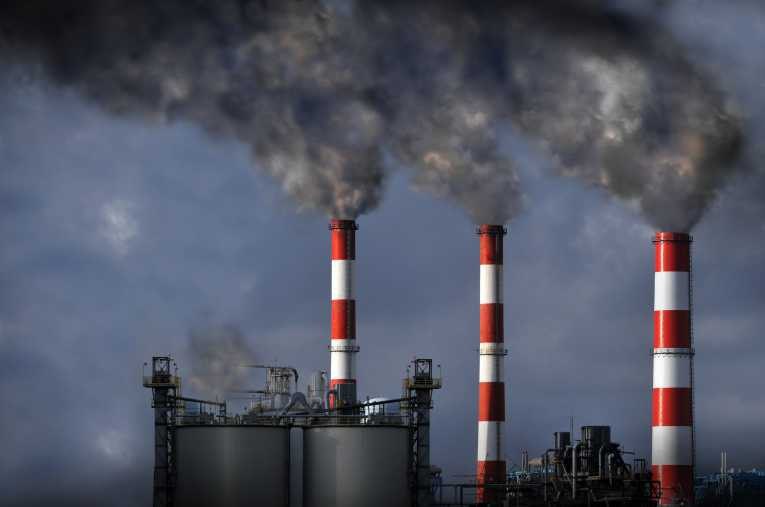

```{r setup, include=FALSE}
knitr::opts_chunk$set(echo = TRUE)
```

# Problem at Hand

- Climate change and increasing greenhouse gas emissions are gaining political attention

- Industries grow and contribute to economy but produce more emissions

- Regulations are imposed affecting economic growth

<!-- BASICALLY GOVERNMENTS SEE POLUTION -> WANT TO DO SOMETHING ABOUT IT BUT THEY DONT KNOW THE ECONOMIC IMPACT SO LETS SEE IF ITS WORTH IT(ECON STANPOINT) USING DATA SCIENCE MAGIC -->

<!-- - How do polluant industries contribute to economic growth -->

<!-- - How do regulations affect economic performance -->

<!-- - How does climate changes affect economic performance -->


<!--  -->


# Objectives

<!-- Maybe we could mention developing vs established economies for each of these points -->
- Measure the impact of pollutant industries on economic develoment

- Measure the effects of gas emission regulations on industry and economy growth

- Measure the effects(cost) of climate change on global economies (e.g. natural disasters)

# Data sets

- Climate change laws per country (LSE Grantham Research Institute on Climate Change and the Environment)

- National income by activity (data.oecd)

- International greenhouse gas emissions (United Nations via Kaggle)

- Greenhouse gas emissions per country per subsector (CAIT Climate Data Explorer)

- National Footprint Accounts 2018 (Global Footprint Network)

# Methodology

- Find correlations between economic growth and emissions per country and sector
  - MultiLevel Regression

- ARIMA or other forecasting methods to forecast future growth and emissions

- Important of us to take seasonality into account!

- Creating a metric for how strong climate change regulations are for each country

- Measure the impact of particular laws to gpd and emissions

<!-- WE NEED A METHOD TO DETERMINE ECOLOGICAL REGULATION PERFOMANCE -->

# Questions

# Thank you


